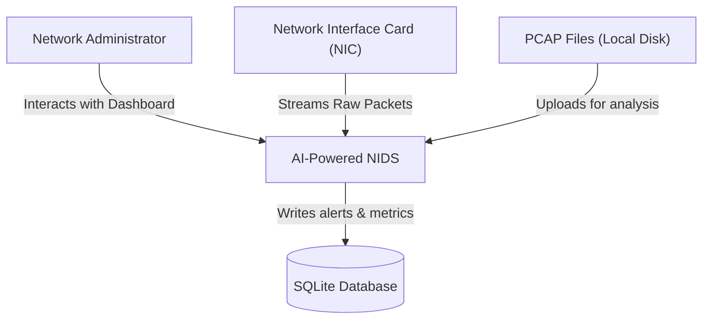
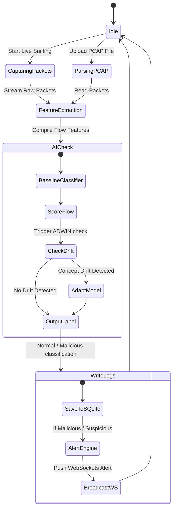
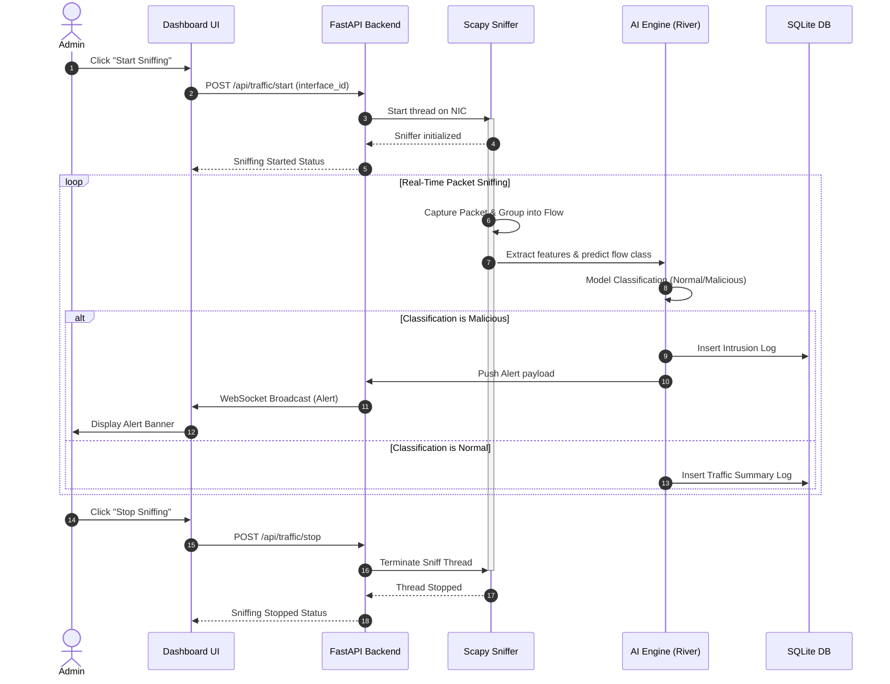
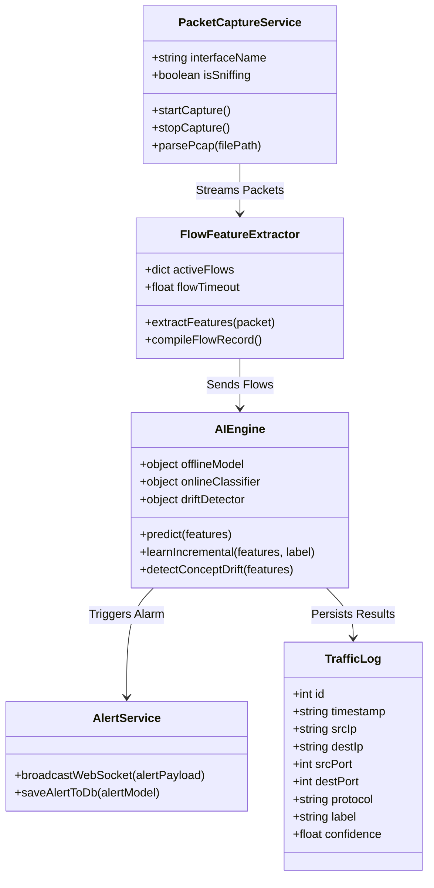
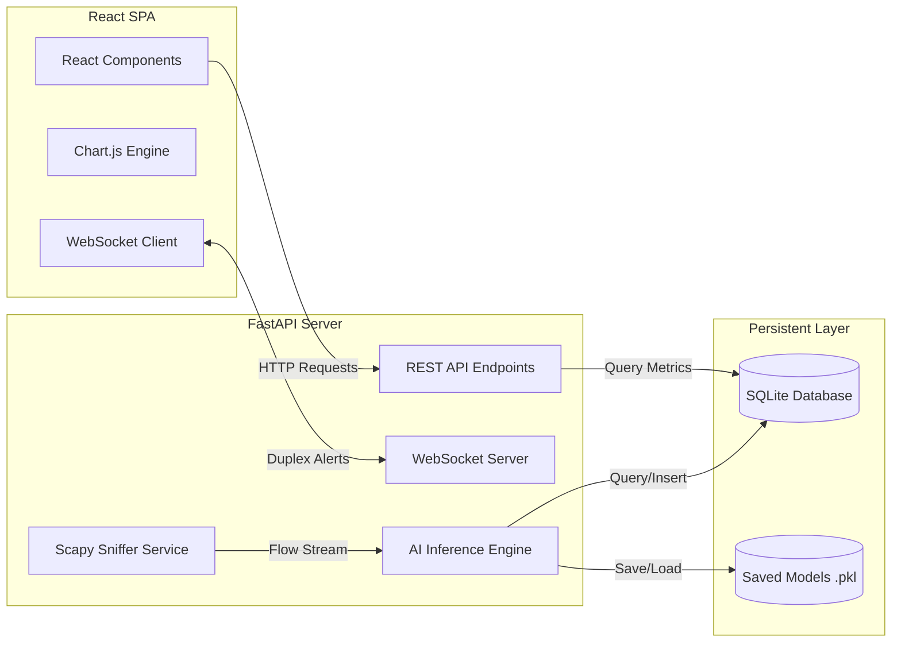
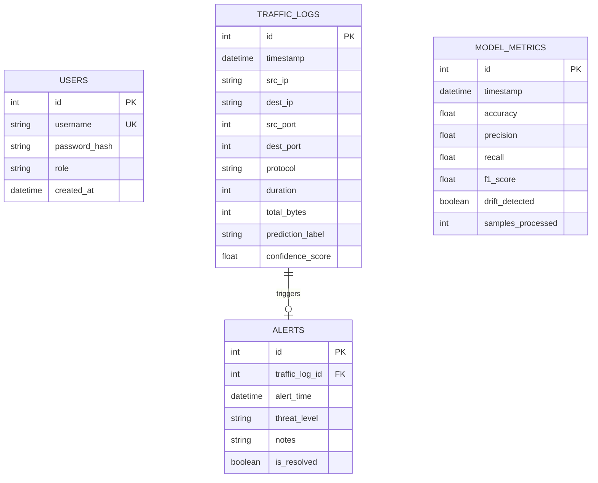
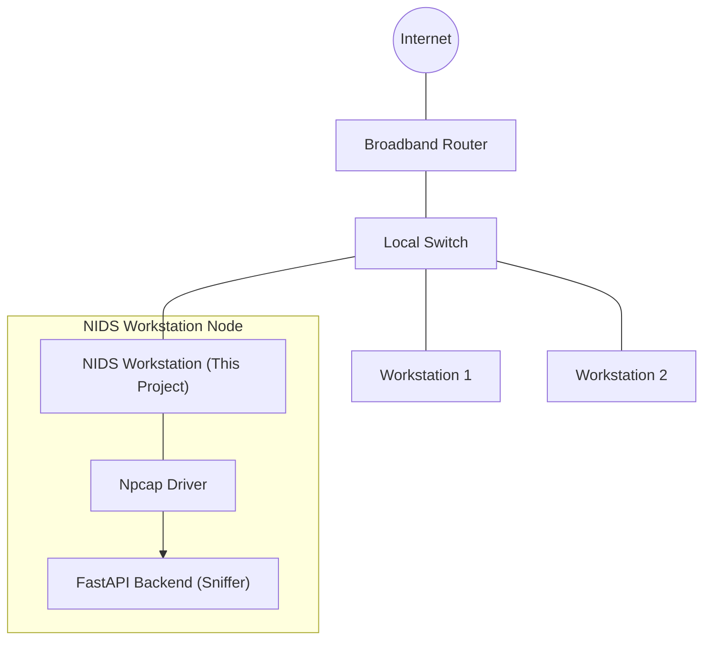

# System Architecture and Modules

---

# Part 3: Architecture & Diagrams

## 3.1 Architectural Overview
The system employs a decoupled, modular client-server architecture designed to run on a single local workstation. It separates resource-intensive network capturing and machine learning processes (Backend) from user interaction and data visualization (Frontend). 

```
+-------------------------------------------------------------------------------+
|                                 LOCAL WORKSTATION                             |
|                                                                               |
|   +-------------------+       REST APIs / WebSockets      +---------------+   |
|   |  React Frontend   |<=================================>| FastAPI App   |   |
|   |  (UI Dashboard)   |                                   | (Python API)  |   |
|   +-------------------+                                   +---------------+   |
|                                                                   ||          |
|                                                                   \/          |
|   +-------------------+        Feature Engineering        +---------------+   |
|   |    Scapy Sniffer  |---------------------------------->|   AI Engine   |   |
|   | (Network Capture) |                                   | (River / SkL) |   |
|   +-------------------+                                   +---------------+   |
|            ^                                                      ||          |
|            | sniffs packets                                       \/          |
|   +------------------------------------+                  +---------------+   |
|   | Network Interface Card (NIC/Npcap) |                  | SQLite DB     |   |
|   +------------------------------------+                  +---------------+   |
+-------------------------------------------------------------------------------+
```

---

## 3.2 System Diagrams (Mermaid)

### 3.2.1 System Context Diagram
Describes the boundaries of the NIDS, indicating how external traffic, network cards, and administrators interface with the system.



### 3.2.2 Use Case Diagram
Maps the actions that the Network Administrator can execute within the application.

```mermaid
usecaseDiagram
    actor Admin as "Network Administrator"
    
    usecase UC1 as "Secure Authenticate"
    usecase UC2 as "View Dashboard Metrics"
    usecase UC3 as "Import PCAP File"
    usecase UC4 as "Sniff Live Traffic"
    usecase UC5 as "Manage ML Models"
    usecase UC6 as "Review Logs & Reports"
    usecase UC7 as "Configure Alerts"
    
    Admin --> UC1
    Admin --> UC2
    Admin --> UC3
    Admin --> UC4
    Admin --> UC5
    Admin --> UC6
    Admin --> UC7
```

### 3.2.3 Activity Diagram
Illustrates the procedural flow of packet processing, classification, logging, and real-time visualization.



### 3.2.4 Sequence Diagram
Tracks the interaction sequence among the UI, Backend Controller, Sniffer, AI Engine, and SQLite database during live capture.



### 3.2.5 Class Diagram
Shows the data structures and service classes within the Python backend application.



### 3.2.6 Component Diagram
Illustrates the physical components of the application.



### 3.2.7 Deployment Diagram
Specifies how the physical components deploy on a single local computer under a local-host runtime environment.

```mermaid
graph TD
    subgraph Workstation["Workstation (Windows 11 / Core i5 / 8GB RAM)"]
        subgraph Browser["Web Browser (Chrome/Edge)"]
            ReactApp["React Frontend SPA (Vite Dev Server : Port 5173)"]
        end
        
        subgraph PythonRuntime["Python 3.10 Runtime"]
            FastAPI["FastAPI Backend App (Uvicorn Service : Port 8000)"]
            Scapy["Scapy Packet Sniffer Thread"]
            River["River Online ML Engine"]
        end
        
        subgraph NativeOS["Windows OS Layer"]
            Npcap["Npcap Packet Capture Driver"]
        end
        
        subgraph StorageLayer["Workstation File System"]
            SQLiteFile[("SQLite DB (app.db)")]
            ModelFiles[("Model Binaries (.pkl)")]
        end
    end
    
    ReactApp <-->|HTTP/WS localhost| FastAPI
    FastAPI <--> SQLiteFile
    FastAPI <--> ModelFiles
    Scapy <--> Npcap : Promiscuous Sniffing
    Scapy --> River : Flow Features
```

### 3.2.8 Database ER Diagram
Defines the tables used to manage accounts, logging, and model parameters.



### 3.2.9 Network Architecture Diagram
Shows the physical and logical placement of the NIDS in a home or SME network. The prototype runs on a local PC, monitoring its own network interface card in Promiscuous Mode, capturing all broadcast or targeted local switch traffic.



---
---

# Part 4: Software Modules Description

Here we define the core modules that construct our Network Intrusion Detection System.

### 4.1 Authentication Module
* **Purpose:** Ensures only authorized personnel can access the system dashboard, configurations, and analytical reports.
* **Mechanism:** Employs JSON Web Tokens (JWT) for stateless session handling. Passwords are encrypted before database insertion using the `bcrypt` algorithm. Upon successful login, the backend returns a signed token, which the React client stores in local storage and includes in the header of subsequent API requests.

### 4.2 Dashboard Module
* **Purpose:** The centralized user interface, presenting system statistics in real-time.
* **Mechanism:** Constructed as a single-page React app. Renders charts showing packet throughput (KB/s), system resource consumption (CPU/RAM), recent alert cards, system active status, and online machine learning tracking curves.

### 4.3 Traffic Import Module
* **Purpose:** Allows administrators to upload pre-captured PCAP files or tabular CSV network data.
* **Mechanism:** Accepts files via multipart form uploads. A background thread processes the file line-by-line or packet-by-packet, preventing backend memory exhaustion when large files are loaded.

### 4.4 Packet Processing Module
* **Purpose:** Interfaces with the physical network adapter to capture and parse network frames.
* **Mechanism:** Uses `Scapy` to sniff packets on selected network interfaces. It strips out Link-layer headers, extracting IP (Network layer) and TCP/UDP/ICMP (Transport layer) parameters, passing these structured summaries to feature extraction.

### 4.5 Feature Extraction Module
* **Purpose:** Aggregates individual packets into statistical connection flows.
* **Mechanism:** Tracks connections using a 5-tuple: `(Source IP, Destination IP, Source Port, Destination Port, Protocol)`. Within a configurable sliding window (e.g., 2 seconds), it aggregates features such as packet counts, total bytes, average packet size, and inter-arrival time before passing the flow record to the AI Engine.

### 4.6 AI Detection Engine
* **Purpose:** The decision-making component of the NIDS.
* **Mechanism:** Runs in a dual-stage setup:
  1. *Offline Classification:* Evaluates incoming flows against a pre-trained Random Forest model for quick, low-overhead baseline classification.
  2. *Online Classification:* Simultaneously routes features through a `River` adaptive classifier (e.g., Hoeffding Adaptive Tree) that updates its classification weights dynamically.

### 4.7 Alert Engine
* **Purpose:** Flags anomalous or malicious activities, routing warnings immediately to the interface.
* **Mechanism:** Analyzes the output classification from the AI Engine. If a malicious or highly suspicious flow is detected, it raises an alert entry in the database and broadcasts a payload to the active dashboard clients via WebSockets.

### 4.8 Visualization Module
* **Purpose:** Translates log numbers and mathematical metrics into readable charts.
* **Mechanism:** Built using `Chart.js` in React. Renders real-time line charts of network throughput, pie charts of threat distributions, a visual confusion matrix updated after batch validations, and timelines of intrusion alerts.

### 4.9 Reports Module
* **Purpose:** Generates summaries of network activity and alert incidents for supervisor reviews or auditing.
* **Mechanism:** Compiles system database logs, aggregating statistics over a user-selected time range (e.g., hourly, daily). The backend formats this aggregated data and exports it as printable PDFs or raw CSVs.

### 4.10 Logs Module
* **Purpose:** Provides a searchable, filterable database table of all network connections analyzed.
* **Mechanism:** Query-optimized database interface that displays the timestamp, 5-tuple info, protocol, classifier predictions, and confidence levels. Supports pagination and keyword filtering on IPs.

### 4.11 Settings Module
* **Purpose:** Exposes configuration settings to administrators without requiring code edits.
* **Mechanism:** Allows users to select the active sniffing interface card, set the alert threshold score, configure database cleanup parameters, and adjust the packet sniffing window timeout.

### 4.12 Model Management Module
* **Purpose:** Displays model statistics and allows analysts to control learning behaviors.
* **Mechanism:** Visualizes current offline and online classifier accuracy, false-positive ratios, and concept drift graphs. Provides controls to reset the online classifier weights or trigger offline retraining on newly aggregated data.

### 4.13 Future Incremental Learning & Concept Drift Module
* **Purpose:** Ensures the system adapts dynamically to changing network profiles over time.
* **Mechanism:** Integrates the ADWIN (Adaptive Windowing) algorithm. ADWIN continuously tracks the rolling average of prediction errors. When a statistical drift is detected, it flags a "Concept Drift Event" to the dashboard, prompting the Hoeffding Adaptive Tree to replace outdated nodes, enabling the model to learn new baseline behaviors without manual offline retraining.
